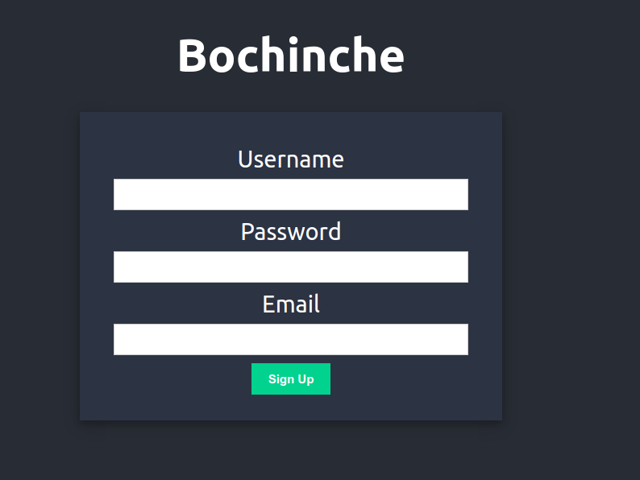
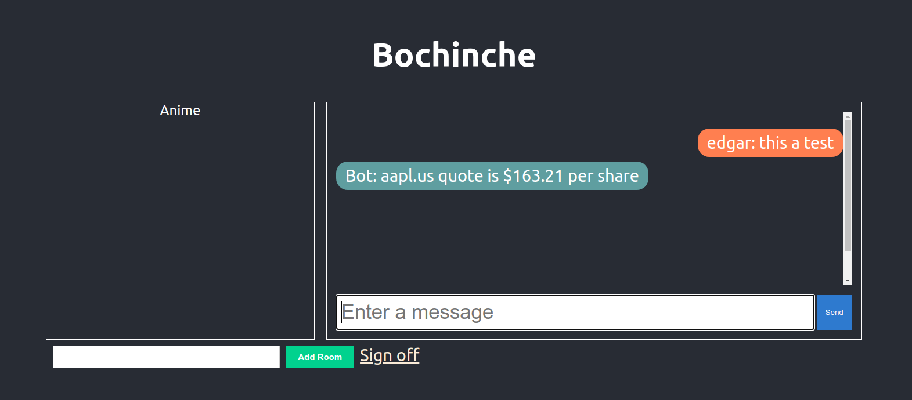

# bochinche
bochinche it's an App to create chat rooms

## Overview
This app uses postgres and rabbitmq docker containers. Configuration is set on the included .env file

## Requirements
- go 1.18
- docker
- [migrate](https://github.com/golang-migrate/migrate/tree/master/cmd/migrate#unversioned) a golang based migration cli

## Running the tests
There are only test for the postgres repository. These test require a test DB
- Create the containers ```make containers```
- Create the test db ```make createtestdb```
- Run the migrations ```make migrateuptest```
- Run the tests ```make test```

## Running the app
- Create the containers ```make containers```
- Run the migrations ```make migrateup```
- Finally run the app ```go run main.go```
- Open the [app](http://localhost:8080/)

## User Guide
First create a new user in the Sign Up page



In the Login Page insert the created credentials

Next in the lobby page you need to create a chat room and selected it to start chatting




## Issues
- Docker image is not working, so don't build with compose